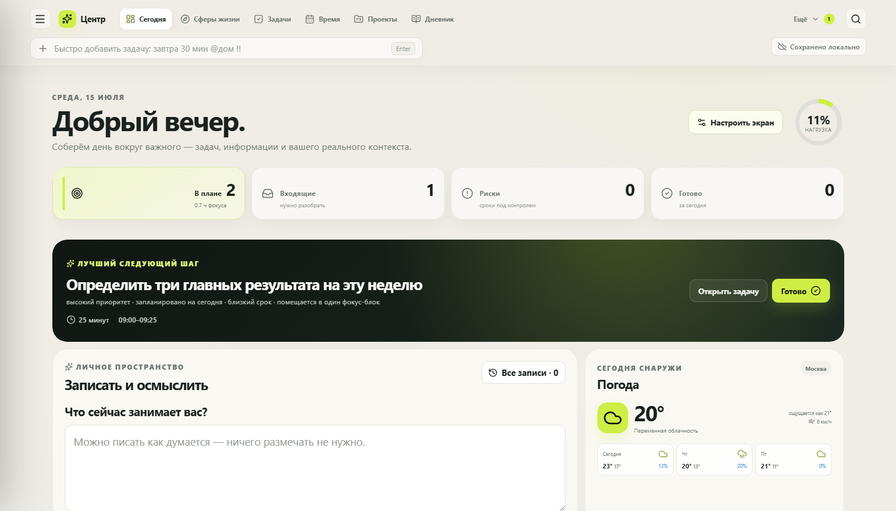
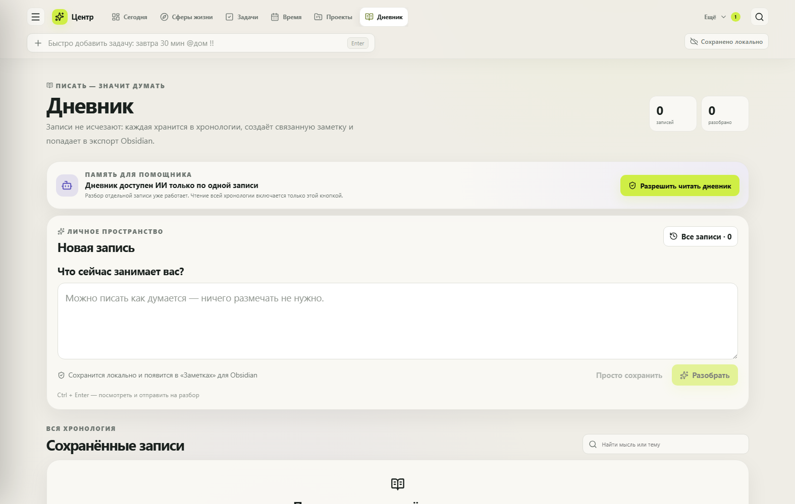
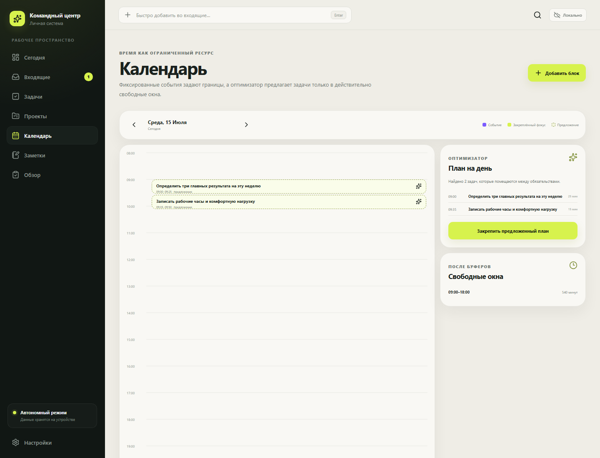
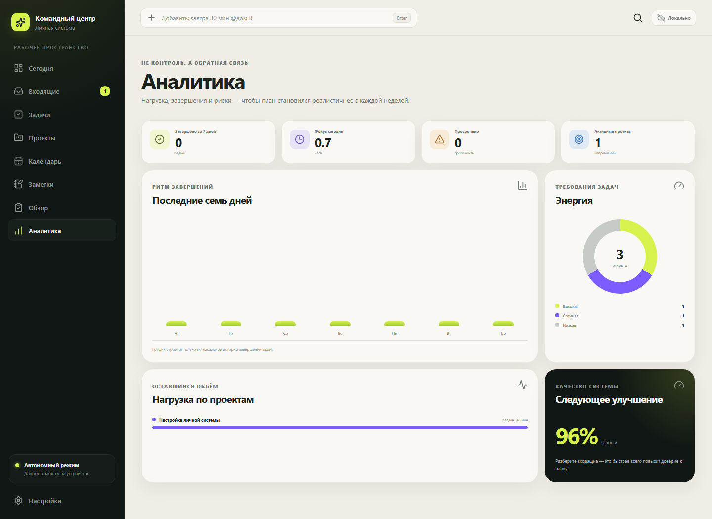
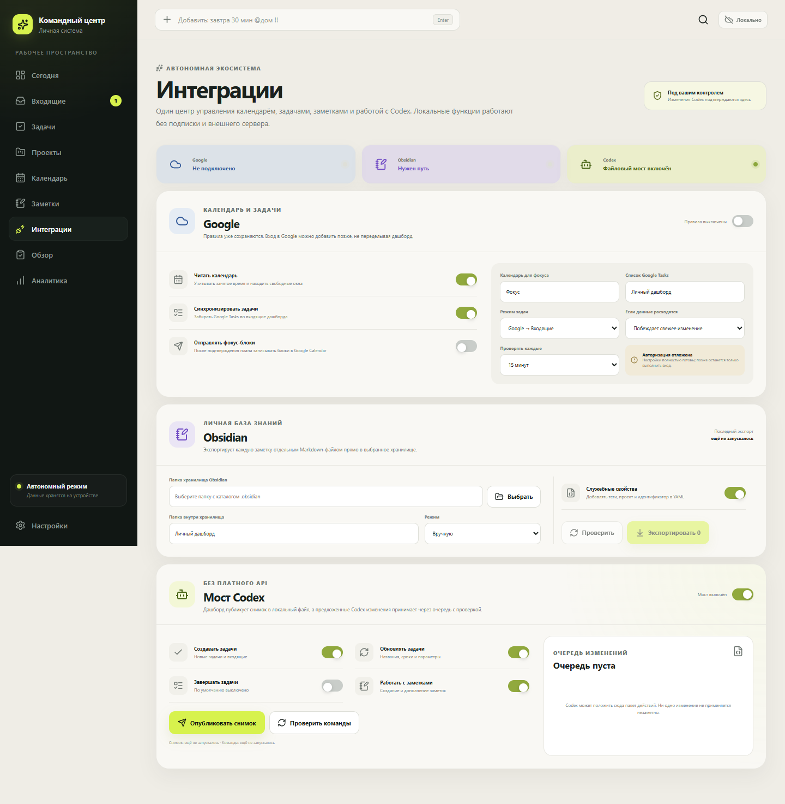
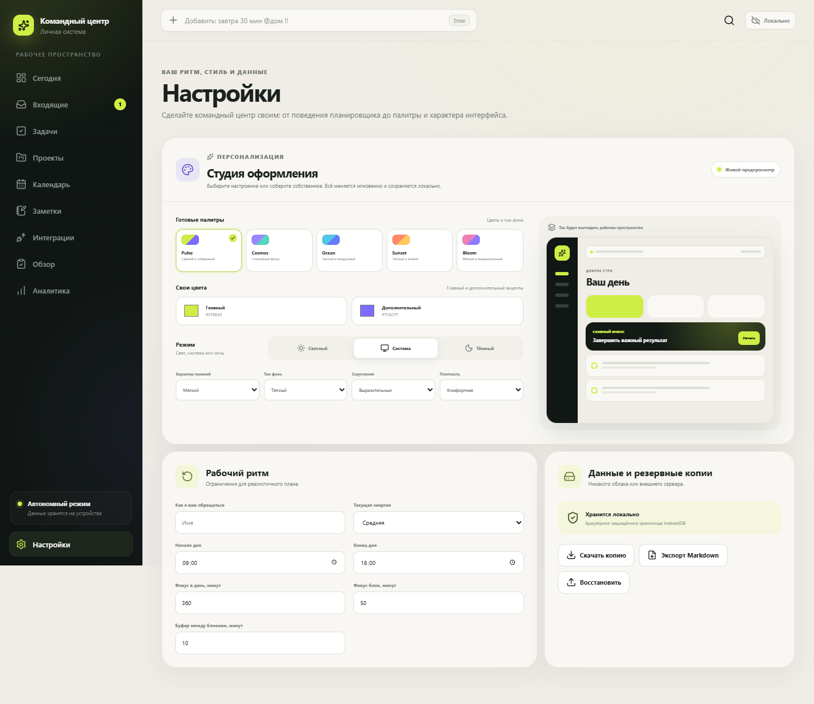

# Личный командный центр

Автономный локальный дашборд для времени, задач, проектов и знаний. Основные функции не требуют Codex или OpenAI API.

Замысел ПСОЖ, утверждённые продуктовые решения и ответы на фундаментальные вопросы собраны в [`docs/PROJECT_FOUNDATION.md`](docs/PROJECT_FOUNDATION.md).

Целевая структура продукта, судьба текущего прототипа и этапы перехода описаны в [`docs/PRODUCT_MAP.md`](docs/PRODUCT_MAP.md).









## Что уже работает

- локальные задачи, проекты и GTD-статусы;
- подробный редактор задачи;
- быстрый ввод с распознаванием сроков, длительности и контекста;
- повторяющиеся ежедневные, будничные, недельные и месячные задачи;
- календарные события и защищённые фокус-блоки;
- поиск свободных окон с учётом рабочих часов и буферов;
- объяснимый план дня и закрепление предложений;
- интерактивный главный экран на 12-колоночной сетке: блоки можно перетаскивать и растягивать мышью;
- отдельная карта сфер жизни: устойчивые связи с проектами без обязательной разметки задач и без искусственного «балла баланса»;
- новая маршрутная оболочка: Главная, GTD и активные пользовательские сферы находятся сверху, а боковая панель служит полным дополнительным меню;
- быстрое создание и редактирование пользовательского виджета кнопкой, наведением или контекстным меню;
- три увеличенных масштаба текста;
- автономный прогноз погоды без ключа API с часовым локальным кэшем;
- список материалов и статей, включая добавление через локальный мост Codex;
- шесть типов пользовательских карточек: текст, ссылка, изображение, показатель, файл и публичный JSON API;
- локальные рекомендации по срокам, перегрузке, входящим и уровню энергии;
- нейтральный текстовый виджет: курсор прямо на полотне, автоматический обычный документ и локальное сохранение без отдельной формы;
- подборка «Осмысление» по обычному тегу и ИИ-действия над выбранным документом без второго пользовательского объекта;
- архив осмысления с полной хронологией, поиском, статусами и явной связью с документом рабочего пространства;
- управляемая память помощника: только явное «Запомнить», ручное редактирование, пауза и удаление;
- точный предпросмотр личного текста перед передачей, подтверждение, поправка и раскрываемое объяснение;
- локальные редактируемые решения по новым ответам: смысл, важный вопрос и следующий шаг можно независимо принять или отклонить;
- необязательный раздел «Личный контекст» с целями, ритмом, предпочтениями, границами и введённым пользователем системным профилем;
- выбор отдельных разделов контекста для каждого разбора — по умолчанию передаётся только запись;
- явный выбор до шести активных формулировок памяти для одного разбора с дословным предпросмотром — по умолчанию память не выбрана;
- отфильтрованный снимок Codex без настроек, путей интеграций и журнала действий; архив осмысления входит только после отдельного разрешения пользователя;
- журнал действий как основа будущей персонализации;
- автоматическая миграция локальных данных;
- резервная копия в JSON и восстановление;
- экспорт задач, проектов и заметок в Markdown;
- рабочие заметки с шаблонами, тегами и связью с проектами;
- локальная аналитика нагрузки и завершений;
- светлая, тёмная и системная темы;
- отдельная мобильная навигация;
- автономная PWA-сборка.
- универсальный объектный слой с документами, ролями, вложенностью, ссылками, встраиваниями и обратными связями;
- рабочее пространство, в котором прежние заметки и новые документы открываются как единые объекты без копирования;
- настоящие URL, переходы назад/вперёд и кликабельный путь к открытой задаче, проекту, сфере или документу.

## Настраиваемый главный экран

Кнопка «Настроить экран» включает редактор сетки. В нём можно:

- перетаскивать блоки за верхнюю плашку;
- растягивать их за правый нижний угол по ширине и высоте;
- сохранять читаемость сложного блока осмысления: его минимальная ширина — половина сетки, компактные виджеты можно уменьшать сильнее;
- скрывать блоки прямо на холсте;
- одной кнопкой создавать новую пользовательскую карточку;
- открывать редактор кнопкой при наведении или правой кнопкой мыши, возвращать скрытые блоки и менять их содержимое;
- выбрать город для прогноза;
- создавать карточки типов «Текст», «Ссылка», «Изображение», «Показатель», «Файл» и «API» с живым предпросмотром.

Системные виджеты сохраняют свою логику, но позволяют менять название и размер. Пользовательские виджеты редактируются целиком. API-карточка выполняет только публичный GET без токенов и показывает выбранное поле JSON; секретные ключи в локальной конфигурации виджета не поддерживаются.

Блок «Материалы» хранит ссылки и тексты локально. Codex может пополнять его через команду `add_reading` в файловом мосте, но для обычного использования Codex и платный API не нужны. Рекомендации сейчас формируются прозрачными локальными правилами; накопленный журнал действий подготовлен для более точной персонализации в следующих версиях.

## Сферы жизни

Раздел «Жизнь» показывает пользовательские контексты — например, работу, отношения, обучение или творчество — и связанные с ними проекты, открытые действия и объём задач. Это не тест и не оценка равномерности жизни: сферу можно не создавать, проект можно оставить без сферы, а каждую задачу отдельно размечать не требуется.

Начиная с `DashboardState` v13 сфера хранится как самостоятельная `LifeArea`, а проект получает устойчивую ссылку `areaId`. При обновлении старые непустые строки `Project.area` объединяются по названию и превращаются в сферы; «Без области» остаётся отсутствием связи. Старое строковое поле временно сохраняется и синхронизируется для совместимости. Переименование, архивирование или удаление сферы не удаляет проекты и задачи. Активные сферы автоматически появляются в верхней панели.

Определения стандартных виджетов также собраны в одном реестре: стартовая сетка, каталог, высоты и минимальная ширина больше не расходятся между разными частями интерфейса.

## Защита от потерь

Текущая схема `DashboardState` v15 добавляет восстанавливаемую корзину и ограниченную историю изменений задач, событий, документов и нативных универсальных объектов. Повторные правки одного объекта в течение пяти минут объединяются, поэтому история не превращается в журнал каждого нажатия клавиши; хранится не более 200 точек возврата.

IndexedDB дополнительно хранит до пяти локальных контрольных копий состояния. При обычной работе новая копия создаётся не чаще одного раза в 15 минут, если данные действительно изменились; в настройках снимок можно создать вручную. Перед восстановлением старой копии текущее состояние сначала сохраняется отдельно. Корзина, версии и снимки управляются в разделе «Настройки → Корзина, версии и контрольные копии».

## Текст и осмысление

Нейтральный блок «Текст» на Главной не является отдельным типом записи. В нём нет квадратной формы и обязательной кнопки сохранения: пользователь ставит курсор прямо на свободное полотно, начинает писать, а первый ввод создаёт обычный документ с автосохранением. Первая содержательная строка становится его исходным заголовком, не дублируясь в теле. Старые виджеты «Записать и осмыслить» безопасно преобразуются в этот текстовый виджет при загрузке.

Рабочее пространство объединяет библиотеку, поиск, фильтры, закрепление, свойства и бесшовный редактор. Заголовок и тело редактируются прямо на полотне без видимых прямоугольных полей; всё сохраняется локально. Выбранный документ имеет собственный URL, а на телефоне библиотека и редактор работают как два последовательных экрана.

Раздел «Осмысление» — только необязательная подборка документов единого рабочего пространства. Обычный документ попадает в неё по тегу `осмысление` или сохранённой истории разбора и открывается тем же редактором без связанной копии. Чтение всей подборки помощником включается отдельно в «Осмыслении» или «Интеграциях». Отдельной обязательной сущности «Дневник» нет. Сохранённые разборы и их метаданные не удалены; интеллектуальные действия должны подключаться к обычному документу, а не возвращать специальный класс ввода.

## Личный контекст

В настройках можно один раз описать цели, рабочий ритм, предпочтения и границы. Опциональный системный профиль содержит только выбранные самим пользователем векторы и его собственное описание проявлений; автоматического определения и скрытых характеристик нет. Профиль хранится локально, входит в читаемую JSON-копию и не попадает в общий снимок Codex.

Ответ Codex появляется как полный проверяемый черновик «Я понял». Контракт ответа версии 3 сохраняет богатый разбор: понимание, наблюдения, возможное объяснение, альтернативы, вопрос и предложенное действие. Общий снимок локального моста имеет схему 2 и отдельную разрешаемую категорию архива осмысления. Начиная с `DashboardState` v11 интерфейс формирует для новых ответов три необязательных локальных предложения: `meaning`, `question` и `next_action`; текущая схема состояния имеет версию 15. Каждое можно отредактировать и независимо оставить в состоянии «ожидает решения», принять или отклонить.

Решение по отдельному предложению не заменяет общую проверку разбора: весь ответ по-прежнему можно подтвердить, поправить или исключить из учёта независимо от `meaning`, `question` и `next_action`. Само принятие ничего никуда не переносит, не создаёт память и не меняет профиль, план, календарь или приоритеты.

Принятые смысл и вопрос добавляются в тот же локальный документ только отдельной кнопкой. Приложение дописывает новый фрагмент, не перезаписывая исходный или отредактированный пользователем текст. Это ещё не запись в хранилище Obsidian: файл обновится лишь при следующем ручном экспорте. Принятый `next_action` также требует отдельной кнопки и создаёт обычную незапланированную задачу во «Входящих», без даты, блока в плане или события календаря.

Связи с созданной заметкой и задачей сохраняются для понятного происхождения. Последующее редактирование, отклонение или удаление предложения либо исходной записи не изменяет уже созданные артефакты и ничего не удаляет снаружи. Разборы, перенесённые из версии 10, не получают решений задним числом: новый слой применяется только к ответам, сохранённым после перехода на версию 11. Если Codex недоступен, исходный текст остаётся сохранённым и приложение продолжает работать без него; автоматического вызова модели или платного API нет.

Каждая запись является обычным локальным документом с тегом `осмысление` и поэтому попадает в следующий ручной экспорт Obsidian вместе с остальными заметками. `DashboardState` v15 безопасно объединяет старую запись и связанную заметку: пользовательский текст документа имеет приоритет, а отличавшийся старый источник сохраняется только в миграционном аудите. Внутренний признак происхождения не зависит от редактируемого тега и не позволяет такому документу случайно попасть в общий снимок Codex.

Подборка «Осмысление» открывает полную хронологию, а кнопка «ИИ-действия» — проверяемый разбор выбранного документа. Подтверждение разбора само по себе не становится постоянным знанием: для этого есть отдельное редактируемое действие «Запомнить». Сохранённую формулировку можно изменить, поставить на паузу или удалить. Память никогда не прикладывается автоматически: пользователь вручную выбирает её для конкретного разбора, а планировщик по-прежнему её не использует.

## Быстрый ввод

В верхней строке можно использовать естественные подсказки:

```text
Позвонить Ивану завтра 30 мин @звонки !!
Еженедельный обзор по будням 20 мин
Подготовить структуру #Дашборд 1 ч
```

- `сегодня`, `завтра`, `послезавтра` задают день;
- `30 мин` или `1 ч` задают длительность;
- `@дом` задаёт контекст;
- `#Проект` связывает задачу с найденным проектом;
- `!` и `!!` повышают приоритет;
- `каждый день`, `по будням`, `каждую неделю`, `каждый месяц` включают повторение.

## Локальный запуск

Для обычного использования дважды щёлкните файл `Запустить дашборд.cmd`. Он откроет приложение в браузере, а локальный процесс автоматически завершится после периода бездействия.

Для разработки:

```powershell
npm.cmd install
npm.cmd run dev
```

После первой сборки производственную версию можно открыть командой:

```powershell
npm.cmd run preview
```

## Проверка

```powershell
npm.cmd run check
npm.cmd test
npm.cmd run build
```

Архитектурные решения описаны в `docs/ARCHITECTURE.md`, продуктовый объём первой версии — в `docs/PRODUCT.md`.

## Интеграции



На отдельном экране доступны:

- сохранённые правила будущей синхронизации Google Calendar и Google Tasks;
- выбор хранилища Obsidian и реальный экспорт заметок в отдельные Markdown-файлы;
- локальный файловый мост Codex без платного API: отфильтрованный снимок, отдельный канал личного разбора, очередь команд и разрешения.

Подробное руководство: [`docs/INTEGRATIONS.md`](docs/INTEGRATIONS.md).

## Персонализация



В настройках доступны готовые палитры, два собственных цвета, светлый и тёмный режимы, разные тона фона, характер панелей, скругления, плотность и три масштаба текста. Выбор применяется сразу, хранится локально и входит в резервную копию.
