# Новая карта продукта ПСОЖ

Статус: целевая продуктовая карта после фундаментального опроса 1–42.  
Дата: 17 июля 2026 года.  
Основание: [`PROJECT_FOUNDATION.md`](PROJECT_FOUNDATION.md).

## 1. Что мы создаём

ПСОЖ — не набор независимых приложений и не расширенный список задач. Это персональная операционная система жизни с единым фрактальным ядром данных, пользовательскими сферами, полноценным рабочим пространством, GTD, календарём, мультимодальной информацией и подключаемым интеллектуальным слоем.

Главная единица системы — человек в контексте своих желаний, интересов, ценностей, отношений, знаний и действий. Интерфейс показывает разные стороны одной связанной базы, не заставляя пользователя обслуживать множество несовместимых хранилищ.

## 2. Карта целевой системы

```mermaid
flowchart TB
    Person["Человек: желания, интересы, ценности, отношения"]

    Person --> Home["Главная: выбранное важное сейчас"]
    Person --> Spheres["Пользовательские сферы"]
    Person --> Tools["Системный слой"]

    Spheres --> GTD["GTD"]
    Spheres --> Family["Семья"]
    Spheres --> Work["Работа"]
    Spheres --> Self["Познание себя"]
    Spheres --> Health["Здоровье"]
    Spheres --> Custom["Любые свои сферы"]

    GTD --> Inbox["Входящие"]
    GTD --> Actions["Следующие действия"]
    GTD --> Projects["Проекты"]
    GTD --> Waiting["Ожидание"]
    GTD --> Someday["Когда-нибудь"]
    GTD --> Review["Обзор"]

    Tools --> Search["Поиск"]
    Tools --> Capture["Универсальный ввод"]
    Tools --> Workspace["Рабочее пространство"]
    Tools --> History["Назад / вперёд / вкладки"]
    Tools --> Automations["Шаблоны и автоматизации"]
    Tools --> Sync["Синхронизация и резервные копии"]
    Tools --> Settings["Настройки, темы, разрешения"]

    Home --> Views["Виджеты и представления"]
    Spheres --> Views
    Tools --> Views

    Views --> Core["Фрактальное ядро универсальных объектов"]
    Core --> Local["Локальные данные, версии, корзина"]
    Core --> Files["Markdown и мультимодальные файлы"]
    Core --> Connectors["Календарь, Obsidian, облака и API"]
    Core --> AI["Разрешённые ИИ и агенты"]
    Core --> Social["Будущий совместный и публичный слой"]
```

## 3. Навигационная модель

### Верхняя панель

Верхняя панель принадлежит пользователю. По умолчанию она содержит Главную и выбранные сферы: GTD, Семью, Работу, Познание себя, Здоровье и другие. Любой раздел можно переименовать, переместить, скрыть или закрепить наверху.

«Пространство знаний» не обязано быть верхней вкладкой. Это глубокая структура рабочего пространства, доступная через ссылки, поиск и вторичную навигацию. Пользователь может вынести её наверх.

### GTD

«Входящие» — список и представление внутри сферы GTD, а не самостоятельный системный инструмент. Универсальный ввод может по умолчанию направлять неразобранное в этот список.

Классический шаблон GTD включает Входящие, Следующие действия, Проекты, Ожидание, Когда-нибудь и Обзор. Все элементы можно переименовать, отключить или представить иначе.

### Системный слой

Системные инструменты обслуживают всю ПСОЖ и по умолчанию не являются сферами:

- глобальный поиск;
- универсальный ввод;
- рабочее пространство и файловая структура;
- история переходов, внутренние вкладки и окна;
- уведомления;
- шаблоны, правила и автоматизации;
- синхронизация, резервные копии, история версий и корзина;
- интеграции;
- персонализация, разрешения и приватность;
- темы и доступность;
- управление подключёнными агентами.

Календарь является сквозной возможностью. В личном шаблоне основное календарное представление находится внутри GTD, но календарные блоки и события могут встраиваться в любую сферу или объект.

### Переходы

Обычная ссылка открывает объект внутри текущего пространства. Система сохраняет источник перехода, прокрутку и состояние редактора. Доступны назад, вперёд и кликабельный путь. Средняя кнопка мыши, контекстное меню или команда открывают объект во внутренней вкладке, соседней области или окне.

## 4. Фрактальное ядро

### Универсальный объект

Вместо множества взаимно несовместимых контейнеров целевое ядро использует универсальный объект. Его роль определяет поведение и представление, но не ограничивает содержимое.

Предварительный состав объекта:

- устойчивый идентификатор;
- одна или несколько ролей: задача, проект, документ, человек, событие, место, сфера, стремление и другие;
- заголовок и универсальные мультимодальные блоки;
- вложенные объекты любых ролей;
- ссылки и встраивания других объектов;
- пользовательские свойства и поля;
- принадлежность к сферам и представлениям;
- состояние: активно, завершено, архивировано, удалено;
- даты, версии, источник и история изменений;
- приватность и разрешения;
- сведения синхронизации.

Роль — не тюрьма для данных. Задача может содержать документ, событие, человека, файл, проект, стремление или другие задачи. Сфера также является объектом и может содержать полную вложенную систему.

### Вложенность и связи

Нужно различать:

- **дочерний объект** — часть структуры текущего объекта;
- **ссылка** — переход к существующему объекту;
- **встраивание** — отображение существующего объекта внутри текущего без копирования;
- **обратная связь** — автоматически видимый список мест, которые ссылаются на объект.

Один документ может быть встроен в задачу, проект и сферу, оставаясь одним документом. Граф связей может содержать циклы. Иерархия вложенности технически защищается от помещения объекта внутрь самого себя и бесконечного отображения.

### Представления

Список, доска, календарь, таблица, карточка, текстовая страница, галерея, временная шкала и граф — не отдельные копии данных, а представления выбранного набора объектов.

Виджет — компактное представление или команда над теми же объектами. Пользователь может разместить одно представление на Главной, внутри сферы, документа или задачи.

## 5. Рабочее пространство

Рабочее пространство — глубокий сквозной слой для создания, чтения и связывания информации. Отдельной обязательной сущности «Дневник» в целевой модели нет: личная запись, заметка, статья и пост являются формами универсального документа.

Целевые возможности:

- блочный мультимодальный редактор;
- короткая запись без обязательного заголовка;
- длинные тексты и статьи;
- папки и вложенные объекты;
- внутренние и обратные ссылки;
- файлы, изображения, аудио и видео;
- граф связей;
- полнотекстовый поиск;
- шаблоны документов;
- импорт и совместимость с Markdown/Obsidian;
- публикация выбранных материалов в будущем.

Команда «В Obsidian» в текущем прототипе должна эволюционировать в «создать документ в рабочем пространстве». Obsidian получает доступ к совместимым Markdown-файлам или синхронизированному представлению, а не к случайной второй копии.

## 6. Функциональные модули

### Ядро первой полноценной системы

- универсальные объекты, вложенность и связи;
- пользовательские сферы и шаблоны;
- Главная с виджетами;
- рабочее пространство;
- GTD как базовый шаблон сферы;
- календарь и временные представления;
- универсальный ввод;
- глобальный поиск;
- локальное хранение, версии, корзина и экспорт;
- адаптивный интерфейс компьютера, телефона и планшета;
- темы и базовая персонализация без ИИ.

### Подключаемые модули

- Google Calendar и другие календари;
- Obsidian и файловые хранилища;
- облачная и межустройственная синхронизация;
- источники новостей и материалов;
- почта и сообщения;
- голос;
- локальные и внешние агенты;
- данные здоровья;
- совместные пространства;
- публичные страницы и социальный слой.

Модуль не должен становиться обязательной зависимостью ядра.

## 7. Интеллектуальный слой

Без ИИ ПСОЖ остаётся полноценной системой: хранит, связывает, показывает, фильтрует, напоминает, повторяет, синхронизирует и выполняет явно заданные правила.

После подключения ИИ пользователь отдельно разрешает доступ к сферам, объектам и операциям. Можно использовать одного помощника или несколько специализированных агентов.

ИИ в перспективе помогает:

- разбирать универсальный ввод;
- искать связи и повторяющиеся закономерности;
- составлять обзоры и сводки;
- задавать вопросы для осмысления;
- работать с текстами и материалами;
- предлагать уместные действия;
- выполнять разрешённые операции;
- взаимодействовать голосом.

Он не должен притворяться, что понимает человека без достаточных данных, навязываться в острый момент или скрыто менять жизнь пользователя.

## 8. Платформы и синхронизация

ПСОЖ имеет общее ядро и устанавливаемые клиенты для компьютера, телефона и планшета. Веб/PWA остаётся одним из клиентов. Платформенные оболочки добавляют файлы, фон, уведомления, общий доступ из других приложений и голос.

Local-first модель означает:

- каждое устройство полноценно работает без сети;
- изменения записываются локально и получают версии;
- после появления сети передаются операции, а не вслепую перезаписывается вся база;
- документы и структура по возможности объединяются;
- бинарные конфликты сохраняют версии;
- файлы могут загружаться лениво;
- состояние синхронизации видно пользователю;
- облачный канал выбирается и заменяется.

## 9. Кастомизация как лестница

1. Темы, цвет, шрифт, масштаб, плотность и движение.
2. Сетка, размеры, порядок и состав виджетов.
3. Пользовательские сферы, вкладки, шаблоны и представления.
4. Поля, формы, фильтры, сортировки и команды.
5. Визуальные правила и процессы без программирования.
6. Безопасные расширения и API.

Готовые шаблоны остаются первичным опытом. Пользователь получает свободу постепенно и не обязан конструировать систему до начала работы.

## 10. Что уже есть в текущем прототипе

Текущая версия — полезный исследовательский каркас, а не фундаментальная архитектура всей ПСОЖ.

### Сохраняем и развиваем

- React/Vite PWA как быстрый веб-клиент и площадку прототипирования;
- автономную работу основных функций;
- задачи, проекты, GTD-статусы и календарь;
- сетку виджетов и темы;
- быстрый ввод;
- сферы жизни как начало будущих пользовательских сфер;
- Markdown-экспорт и интеграционное направление Obsidian;
- резервные копии и миграции состояния;
- безопасный локальный мост Codex и явные разрешения;
- тесты планировщика, хранения, связей и интеграций.

### Обобщаем через миграцию

- фиксированные `Task`, `Project`, `Note`, `CalendarEvent` и `ReadingItem` — в роли универсальных объектов; прежний `ReflectionEntry` уже объединён с `Note` в схеме v15;
- раздельные массивы `DashboardState` — в объектное хранилище, индекс связей и представления;
- фиксированный `ViewId` — в маршруты пользовательских сфер, инструментов и объектов;
- `LifeArea` — в универсальную сферу-контейнер;
- типы пользовательских карточек — в общий механизм представлений и блоков;
- записи осмысления — в отфильтрованное представление документов рабочего пространства с происхождением, метаданными анализа и правами.

### Убираем только после безопасной миграции

- «Входящие» как самостоятельный пункт глобальной навигации;
- обязательный отдельный раздел «Дневник»;
- жёсткое деление навигации на заранее прошитые экраны;
- необходимость копировать данные между разделами.

Существующие пользовательские данные нельзя терять. Старые модели остаются доступными через адаптер до завершения миграции.

## 11. Этапы разработки

### Этап A. Зафиксировать основу — выполнено концептуально

- фундаментальные вопросы 1–42;
- продуктовая карта;
- публичный исходный прототип;
- базовые резервные копии.

### Этап B. Универсальное объектное ядро — второй совместимый срез выполнен

- схема универсального объекта;
- блоки, дети, ссылки и встраивания;
- индекс обратных связей;
- версии, архив и корзина;
- адаптер чтения текущего `DashboardState`;
- миграционные тесты.

### Этап C. Новая оболочка и навигация — первый срез выполнен

- пользовательские верхние сферы;
- Главная как особое настраиваемое представление;
- системная вторичная навигация;
- назад, вперёд, хлебные крошки и внутренние вкладки;
- адаптивная мобильная модель тех же переходов.

### Этап D. Рабочее пространство — начат

- универсальный мультимодальный документ;
- полноценный и быстрый редакторы;
- файлы, папки, ссылки, встраивания и поиск;
- Markdown/Obsidian без лишнего дублирования.

### Этап E. GTD и календарь поверх нового ядра — начат через адаптер

- GTD как готовый редактируемый шаблон сферы;
- Входящие как список внутри GTD;
- задачи и проекты как роли объектов;
- документы и любые вложения внутри задач;
- календарные представления и внешняя синхронизация.

### Этап F. Мобильность и межустройственная синхронизация

- полноценный мобильный интерфейс;
- устанавливаемые оболочки;
- журнал операций и разрешение конфликтов;
- файлы между устройствами;
- подключаемые облачные каналы;
- уведомления и фон.

### Этап G. Конструктор платформы

- пользовательские поля и представления;
- визуальные правила;
- переносимые шаблоны и темы;
- безопасные расширения.

### Этап H. Интеллектуальный слой

- раздел персонализации;
- разрешения по сферам и объектам;
- один или несколько агентов;
- анализ универсального ввода;
- тактичная проактивность и уровни автономности;
- голос.

### Этап I. Специализированные и социальные модули

- здоровье;
- почта и внешние источники;
- совместные пространства;
- публичные страницы, сообщества и лента.

## 12. Результат первого проверяемого рубежа

Вертикальный прототип новой архитектуры собран. Его критерии на 17 июля 2026 года:

1. ✅ Создание и переименование активной сферы; верхняя панель строится из пользовательских данных.
2. ✅ Страница универсального объекта и создание внутри объекта другой роли.
3. ✅ Один документ виден в рабочем пространстве и может быть встроен в задачу или сферу без копирования.
4. ✅ Настоящие ссылки, назад/вперёд, путь перехода и восстановление прокрутки.
5. ✅ Быстрый ввод направляет неразобранное во «Входящие» внутри GTD.
6. ◐ Существующие задачи, проекты, события и заметки уже читаются как одни объекты в разных представлениях; полная миграция всех редакторов ещё впереди.
7. ✅ Схема v14 сохраняет нативные объекты, связи, корзину и версии; повреждённые или будущие данные не перезаписываются молча.
8. ✅ Совместимый адаптер не создаёт вторую редактируемую копию прежних данных.
9. ✅ Удаление задач, событий, заметок, записей осмысления и нативных объектов стало восстанавливаемым.
10. ✅ Настройки показывают корзину, до 200 точек возврата и до пяти локальных контрольных копий.

Рубеж подтвердил жизнеспособность самой рискованной части идеи — универсального фрактального ядра. Визуально и интерактивно проверены desktop, планшет и телефон; автоматический контур содержит 126 тестов в 21 файле.

## 13. Текущий этап проекта

Проект вышел из стадии «рисуем GTD-дашборд» и перешёл к работающему эволюционному ядру платформы.

Теперь реализовано:

- подтверждена большая продуктовая концепция;
- собран работающий локальный прототип;
- проверены интерфейсные направления, виджеты, GTD, календарь, заметки, сферы, темы и локальный мост;
- сформулированы требования к автономности, ИИ, вложенности, рабочему пространству и мобильности.
- добавлен обязательный нативный объектный граф в `DashboardState` v13, а схема v14 дополнила его защитой данных;
- прежние данные подключены детерминированным адаптером без дублирования источника правды;
- реализованы вложенность, встраивание, обычные и обратные связи, ревизии и защита от циклов;
- верхняя навигация строится из сфер пользователя, а «Входящие» перемещены внутрь GTD;
- появились страницы сферы, универсального объекта и единого рабочего пространства;
- локальный мост согласован со снимком v2 и получил строгую валидацию команд;
- миграция и автосохранение работают fail-closed с предмиграционным safety snapshot.
- удаление основных сущностей идёт через корзину, редактирование создаёт объединяемые точки возврата;
- локальное состояние получает до пяти независимых контрольных копий с безопасным восстановлением.

Следующая сторона проекта — этап D: единый канонический материал и полноценное рабочее пространство. Первый шаг — свести обычную заметку, текст записи осмысления и нативный документ к одному редактируемому объекту без потери происхождения. Затем нужны блочный мультимодальный редактор, файлы, удобная структура, полнотекстовый поиск и двусторонний обмен с Obsidian. После этого GTD можно постепенно перевести с совместимого адаптера на единое каноническое ядро, не ломая текущую рабочую систему.
